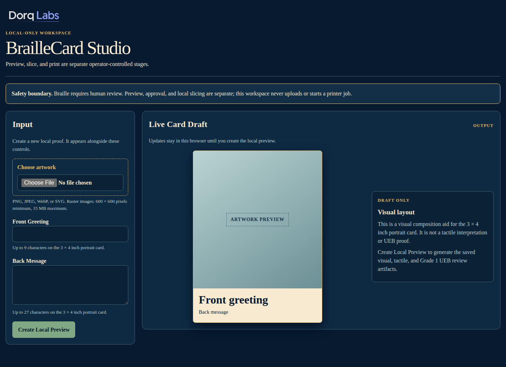
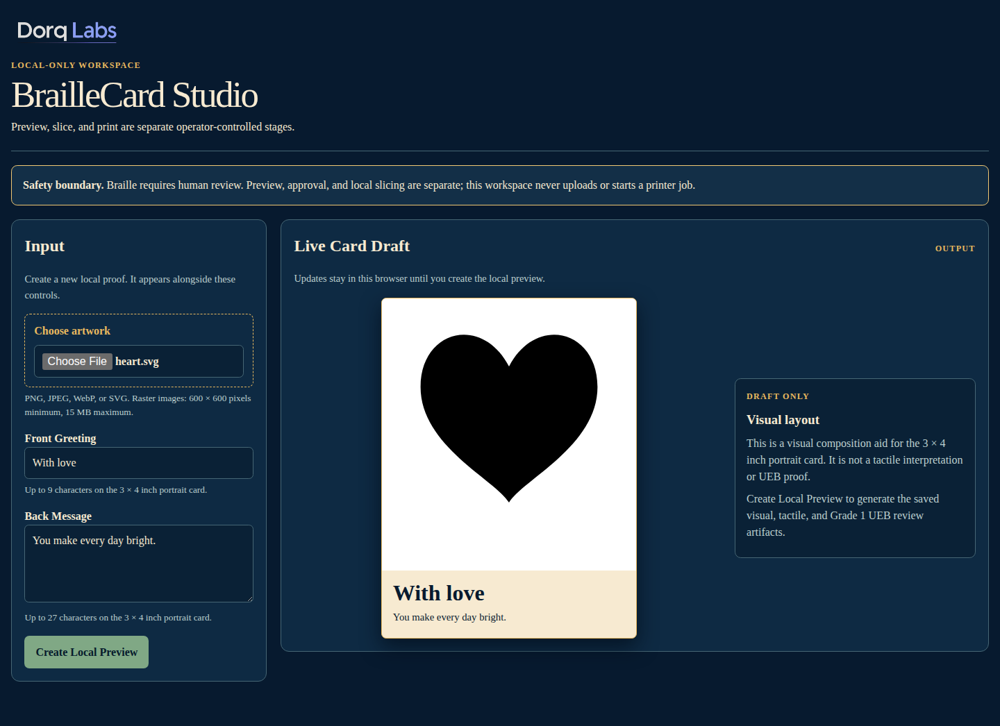
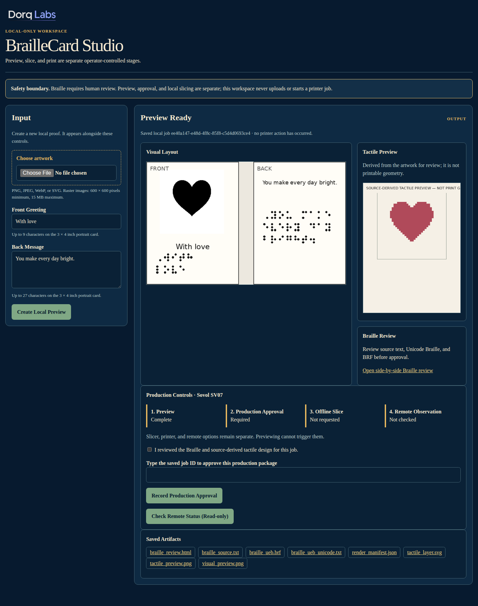
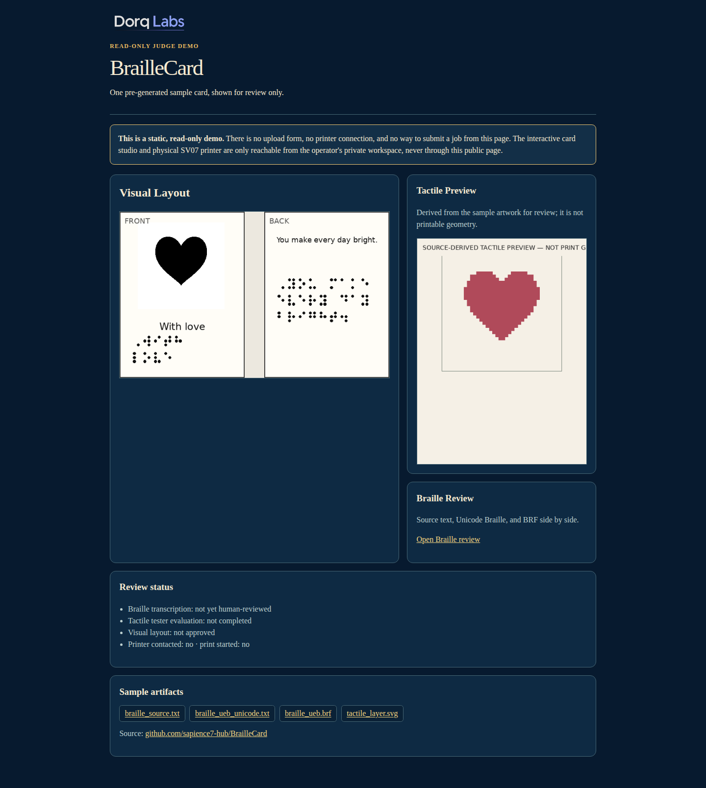

# BrailleCard

Create personalized Braille photo cards for friends and family who are blind
or have low vision.

This repository generates one deterministic, machine-checked production package
for the flat 3 × 4 inch portrait reference card in `docs/PRODUCT_GOAL.md`. It does not
discover, contact, upload to, or start a printer.

## Screenshots

| | |
| --- | --- |
|  |  |
| Local Studio — input | Local Studio — live draft preview |
|  |  |
| Local Studio — rendered preview + production controls | Public judge demo — [braillecard.dorqlabs.com](https://braillecard.dorqlabs.com) |

A ready-made, printer-labeled sample output package (SVG, tactile layer,
UEB Braille in three formats, and G-code sliced for a Sovol SV07) is checked
in at [`examples/sample-output/`](examples/sample-output/) so it can be
inspected without owning the hardware — see
[Evaluating without the hardware](#evaluating-without-the-hardware) below.

System prerequisites are Python 3.12, liblouis with `en-ueb-g1.ctb`, ImageMagick,
Pillow, ReportLab, and the pinned `manifold3d==3.5.2`. OrcaSlicer is used only as
an offline command-line slicer. On this arm64 host, install its pinned extraction:

```sh
tools/bootstrap_orca.sh
```

Generate the reference package:

```sh
PYTHONPATH=src python3 -m braille_card \
  --image examples/heart.svg \
  --card examples/card.json \
  --output dist/reference-card
```

Generate only the local review artifacts:

~~~sh
PYTHONPATH=src python3 -m braille_card \
  --preview-only \
  --image examples/heart.svg \
  --card examples/card.json \
  --output dist/local-preview
~~~

Preview-only output contains the retained/normalized image, visual and tactile
previews, plus uncontracted UEB review artifacts. It does not generate
production geometry or G-code, invoke OrcaSlicer, start a browser, or contact
a printer.

Run the local browser workspace:

~~~sh
PYTHONPATH=src python3 -m braille_card --serve
~~~

The workspace binds to `127.0.0.1:8765` by default. It saves preview jobs
locally and keeps visual/Braille/tactile review separate from slicing, printer
approval, and remote observation.

To enable its **read-only** Sovol SV07 status check, configure Moonraker only
in the shell that starts the local studio. Do not put credentials in a job file
or browser form:

~~~sh
export MOONRAKER_URL="http://printer.local"
export MOONRAKER_API_KEY="your-local-moonraker-api-key"
PYTHONPATH=src python3 -m braille_card --serve
~~~

`MOONRAKER_BEARER_TOKEN` is supported instead of `MOONRAKER_API_KEY`. The
current browser integration queries status only after an operator clicks its
button; it cannot upload G-code, start a print, run G-code, or alter printer
state.

The destination must be absent or empty so stale files cannot leak into a
manifest. Run all gates with `pytest -q`. The generated G-code remains a file;
printing, Braille review, tactile testing, and operator quality control are
deliberately human steps documented inside the package.

## Printer requirements

The software pipeline (image handling, UEB Braille translation, tactile
geometry, slicing) runs entirely offline and needs no printer. Physical
printing has been validated against exactly one target:

- **Printer:** Sovol SV07
- **Nozzle:** 0.4 mm
- **Filament:** SV07 stock PLA profile
- **Layer height:** 0.20 mm
- **Slicer:** OrcaSlicer 2.4.2 (bundled offline, invoked via CLI only — see
  `tools/bootstrap_orca.sh`)
- **Build volume used:** within the SV07's stock 220 × 220 × 250 mm

G-code for any other printer/nozzle/filament combination has not been
generated or tested. Klipper + Moonraker + Mainsail are only needed for the
optional **read-only** remote status check described above; nothing in this
repository can upload a file to a printer or start a print.

## Evaluating without the hardware

You do not need a Sovol SV07 (or any printer) to evaluate the software:

1. Run `pytest -q` — 30 automated gates cover UEB translation accuracy, ADA
   Braille dimensional ranges, tactile-geometry safety checks, and
   byte-for-byte deterministic output.
2. Run the `--preview-only` command above, or `--serve` and use the browser
   Studio, to generate a real visual + tactile + Braille preview from any
   image in seconds.
3. Inspect [`examples/sample-output/`](examples/sample-output/) — the
   complete, checksummed production package (SVG, tactile layer, UEB in
   three formats, STL/3MF, and the SV07-labeled G-code) generated from the
   checked-in example photo, so you can see real slicer output without
   running a slicer yourself.
4. Visit the public, read-only demo at
   [braillecard.dorqlabs.com](https://braillecard.dorqlabs.com) for a
   pre-rendered sample card review page (static; no upload form, no printer
   connection — see `docs/JUDGE_DEMO_HOSTING.md`).

## AI-assisted development

BrailleCard was built end-to-end through an AI-assisted, multi-agent
workflow. This section is deliberately specific about who did what.

**Codex** wrote the large majority of the core implementation. Most of the
image-handling, UEB Braille translation, tactile-geometry generation, and
OrcaSlicer integration in `src/braille_card/` was produced by an
unattended, iterative Codex `$goal` run against a written product spec
(`docs/PRODUCT_GOAL.md` / `GOAL.md`) and a hard safety boundary ("never
contact a printer") that the spec encodes as a non-negotiable stopping
condition. `scratchpad.md` in this repo is Codex's own iteration log from
that run (see "iteration 2", "iteration 5", "iteration 7" — locating an
authoritative UEB reference, fixing a slicer Boolean-union crash, and
isolating a PDF non-determinism bug). A second Codex session independently
built the entire local-render preview slice
(`src/braille_card/preview.py` + its tests) from a written implementation
plan, reviewed by an independent DeepInfra-hosted model before being merged.

**Claude Code** (this assistant) did project planning, architecture and
safety review, the browser Studio's production-approval/slicing/remote-status
workflow, dispatching and reconciling multiple independent AI code reviews,
infrastructure (the Cloudflare Tunnel routing and this public judge demo),
and packaging this submission.

**Hermes**, a local multi-model gateway, was used to fan out independent
skeptical reviews of the remaining gap to a shippable v1 across several
different models (DeepSeek-V4-Pro, Qwen3-Coder-480B, and others) at a total
cost of a few cents, and to run free/local models for lower-stakes tasks —
without it, this project would have relied on a single reviewer's blind
spots instead of several independent ones.

**Major product and engineering decisions** — made by the human author, not
delegated to any model: treating Braille generation as structured text
processing through a real UEB engine (liblouis) rather than image
generation, because vision models frequently render Braille dot patterns
incorrectly; shipping a flat single-panel 3 × 4 card as the MVP construction
instead of a hinged/folded card; the non-negotiable rule that no code may
ever contact, upload to, or start a physical printer automatically, with
every review pass (Codex, Claude Code, and every independent Hermes-routed
model) required to respect that boundary; and deferring public hosting of
the interactive app until a separate, printer-and-upload-stripped read-only
demo mode existed, rather than exposing the real app.

**GPT-5.6** (ChatGPT) drove the DorqLabs channel/presentation branding this
submission is shown under — the layer a judge actually sees before the app
itself. It generated several branding-image concepts for DorqLabs
("AI tools for smarter accessibility," "DorqLabs: Building inclusive AI
solutions," and others), then did real iterative production work on the
YouTube channel banner: it caught that an early upload was the internal
instruction-guide image rather than the finished banner, explained YouTube's
device-specific safe-area crop (a 2560 × 1440 banner with all essential
content confined to the central 1546 × 423 "viewable on all devices" box),
and pushed the final banner copy down to just "DorqLabs — Practical,
open-source AI tools — BrailleCard image" once it identified the fuller
version wouldn't survive mobile cropping. ([conversation](https://chatgpt.com/share/6a5f3b39-87ec-83ea-8f13-7dd3687db147))

## Build Week development

Every commit in this repository's history falls within 2026-07-18 through
2026-07-21 (`git log --reverse --format='%ad %h %s' --date=short`), i.e. this
entire project — spec, implementation, tests, browser Studio, and this public
judge demo — was built during OpenAI Build Week. It has a conceptual
predecessor, an earlier personal project (`dorqlabs-3d-printer-ai`, private,
Sovol SV07 network/reliability tooling) that shares no code with this
repository but informed some early tactile-card decisions.
